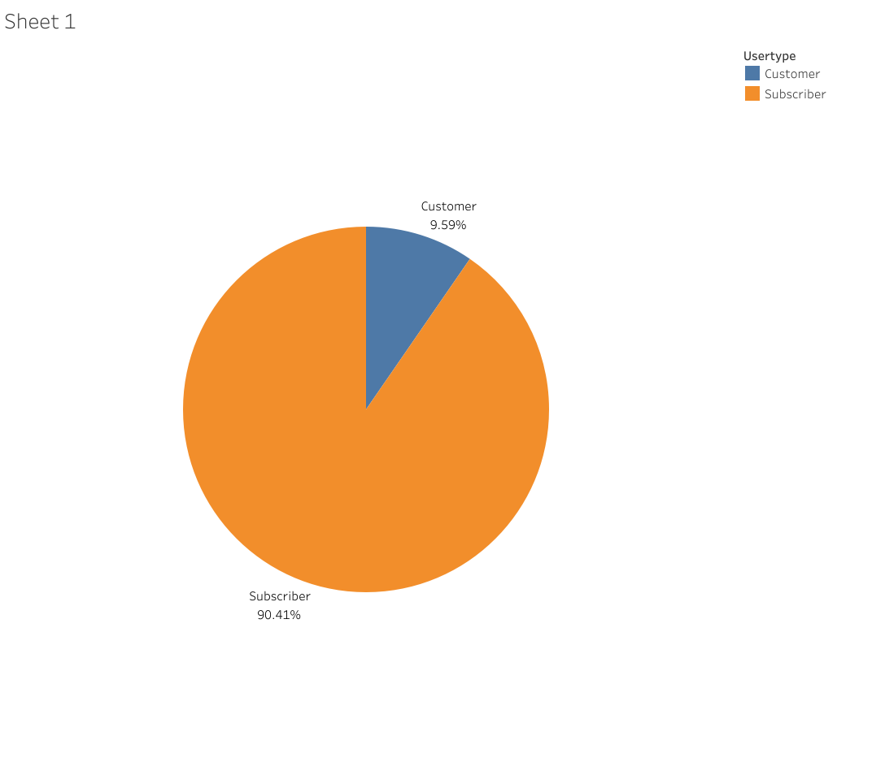

# Google Data Analytics Capstone: Cyclistic (Track1)
Google Data Analytics-Capstone-Track1-Cyclistic-2018  
Course: [Google Data Analytics Professional Certificate](https://www.coursera.org/professional-certificates/google-data-analytics)
## Introduction
In this capstone/case study, I am to carry out the tasks of a junior data analyst for a fictional company, **Cyclistic**. It includes  the steps of the data analysis process: Ask, Prepare, Process, Analyze, Share & Act. 

### Table of Contents(links):  
1. Dataset :[Cyclistic Trip Data](https://divvy-tripdata.s3.amazonaws.com/index.html)  
2. [Ask](#ask)  
3. [Prepare](#prepare)  
4. [Process](#process)   
5. [Analyze](#analyze-and-share)  
6. [Share](#analyze-and-share)  
7. [Act](#act)
8. R code: [all in one]()
9. Data Viz: [Tableau](https://public.tableau.com/app/profile/shreeram.t/viz/cyclistic2018_v1/Dashboard1#1)

## Scenario
You are a junior data analyst working in the marketing analyst team at Cyclistic, a bike-share company in Chicago. The director of marketing believes the company’s future success depends on maximizing the number of annual memberships. Therefore, your team wants to understand how casual riders and annual members use Cyclistic bikes differently. From these insights, your team will design a new marketing strategy to convert casual riders into annual members. But first, Cyclistic executives must approve your recommendations, so they must be backed up with compelling data insights and professional data visualizations.

### Deliverables:
1. A clear statement of the business task
2. A description of all data sources used
3. Documentation of any cleaning or manipulation of data
4. A summary of your analysis
5. Supporting visualizations and key findings
6. Your top three recommendations based on your analysis

### Company(Imaginary)
For detailed case study info refer :[Case Study 1](https://d3c33hcgiwev3.cloudfront.net/ymogSWd_R2ujQawZle3_rQ_12891ea7af0a487bad109a95d513b2f1_DA-C8-Case-Study-1-PDF.pdf?Expires=1699747200&Signature=hDg18FlBQpI4be7eo-faIbX17w59Maz58vjxR~5hlRrazgGtbRGwHYrR3857St7WdVZTNkTCa5RnZLteMf8wmJOHUTmi~UXWWbPjAODw05QoJlWh5Y-F7K5uONCYiZywcqsqVAwh5hbwc~zeMYUfR9Z4Ogm5W6chOvAbJInn91o_&Key-Pair-Id=APKAJLTNE6QMUY6HBC5A)

## Ask
Three questions will guide the future marketing program:
1. How do annual members and casual riders use Cyclistic bikes differently?
2. Why would casual riders buy Cyclistic annual memberships?
3. How can Cyclistic use digital media to influence casual riders to become members?

Moreno has assigned you the first question to answer: How do annual members and casual riders use Cyclistic bikes differently?

## Prepare
Using the dataset provided by the course to analyze and identify trends from Jan 2018 to Decc 2018 which is present in 4 Quarters .[Cyclistic Trip Data](https://divvy-tripdata.s3.amazonaws.com/index.html)  

This is the public data provided by Motivate International Inc. under the license quoted on the website:  
Bikeshare hereby grants to you a non-exclusive, royalty-free, limited, perpetual license to access, reproduce, analyze, copy, modify, distribute in your product or service and use the Data for any lawful purpose (“License”).  
For more info on Prohibited Conduct Visit: [license](https://divvybikes.com/data-license-agreement).  
As for preparing the dataset, it includes the following:  
1. Download data and store it appropriately.
2. Identify how it’s organized.
3. Sort and filter the data.
4. Determine the credibility of the data.

Refer the analysis log covering this and the process part, it's not that big (surprisingly, unless I did it totally wrong) so I put all the R commands in one place.  

Log: [log](https://github.com/Ill-Omen0-0/GDA_Capstone/blob/main/analysis.R)
 

## Process
For the processing step (which I consider to be the most important in the analysis process) I went with R.

Deliverables:
1. Check the data for errors.
2. Choose your tools.
3. Transform the data so you can work with it effectively.
4. Document the cleaning process.

From combining datasets, sort, filter to cleaning and transforming data, all is recored in the R log file: [log](https://github.com/Ill-Omen0-0/GDA_Capstone/blob/main/analysis.R)

## Analyze and Share  

Data Viz: [Tableau](https://public.tableau.com/app/profile/shreeram.t/viz/cyclistic2018_v1/Dashboard1#1)  
Note : The pie chart I forgot to include in the tableau public....Well if you know the way around Tableau, you'll know how to make a simple pie chart but the picture is included in this.  
Firstly we need to Identify how much do each usertype amount to in contrast to the whole in terms of trip_id (which is unique for each ride) in the year 2018:  

Clearly the Subscribers make around 90% of the total while the casual riders aka the Customers are about 10%.  

Now, considering that is was early on in 2018 the casual riders aren't much (partily because of my fault for chooing the year 2018 to do analysis on).

Next the number of trips distributed by months,weekdays and hours of the day separated by gender are visualized below:  

*before taking a look at the viz please note that in the viz the x-axis has titles which inclues 'start time' so to clarify there's two datetime cols in the dataset but when it comes to visualizing we only need a single 'time' column for which either of them could work hence rather than creating a separate col for this I used the existing one so as to not increase the dataset size overall.  

TLDR: it doesn't matter if it says 'start time' or 'end time' in the x-axis title, it just indicates 'time'.*

.png)

After visualizing the sum of tripduration, we move onto visualzing the average tripduration distributed by months, weekdays and hours of the day separated by gender are visualized as shown below:  

.png)  

Now after seeing both the visualzations the following things are observed:  
1. The users with gender unspecified are customers for the most part, in other words customers/casual users don't mention thier gender or birthyear since they are not signing up for a subscription essentially.
2. SUM: Overall regardless of gender the Subscribers have put in way more tripduration than Customers which makes sense.
3. AVG: When you look at the Average Trips, the Customers tend to cycle longer than the Subscribers do on average again regardless of gender. It doesn't change throughout the year, week or day.

Conclusion:
- The users with gender unspecified are customers
- The casual commuters travel longer but less frequently than members. They make longer journeys on weekends and during the day outside of commuting hours whereas the Subscribers essentially travel during commuting hours for work or something of that sort, hence the Subscribers don't make long journeys but they repeat the same journey to their workplace or something of that sort.
- If the analysis was done on future datasets with latitude and longitude data it would've been possible to figure out where casual customers are commuting to(if its for recreational purpose then it'd like something out of workplace or residential areas).

Summary:  
- Customers: bike for long hours but less frequently.
- Subscribers: bike for short hours but more frequently.

## Act

After performing analysis we identified the differences between Customers and Subscribers marketing strategies can be developed to eventually turn the Customers into Subscribers.  

Recommendations for marketing strategies:
- offering discounts or special passes on the weekends or holidays during the right time of the season could be a viable plan to attract Customers to Subscribe.
- marketing and advertisiing aimed at the Customers which encourages them to take the bike share for commute for eg near an university or a museum aiming to convert them into Subscribers(may also consider special offer for joining/first month)
- Can totally see that the total trips taken during winter is relatively low, so to counter that yet again seasonal passes may be promoted.
